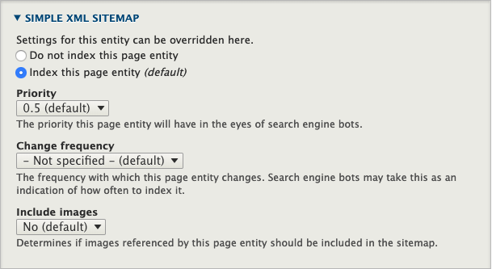

# Development

- [Development](#development)
    - [Modules](#modules)
        - [Updating Dropsolid modules](#updating-dropsolid-modules)
    - [Features](#features)
        - [Config](#config)
        - [Functional](#functional)
            - [READ EVERY SINGLE README IN EVERY SINGLE CUSTOM MODULE.](#read-every-single-readme-in-every-single-custom-module)
    - [Blocks](#blocks)
    - [Paragraphs](#paragraphs)
        - [Mixing it up](#mixing-it-up)
    - [Site building](#site-building)
                - [Layout Builder](#layout-builder)
                - [Homepage construction (Flex only)](#homepage-construction-flex-only)
                - [Facets](#facets)
                    - [Creating a Facet:](#creating-a-facet)
                    - [Adding a Facet to your page](#adding-a-facet-to-your-page)

## Modules

### Updating Dropsolid modules

Currently unsupported, but the plan is that they will work the same as any
normal contrib module.

Important to note is that most patches are inside this distribution's
dependencies. Eg. the patches that add support for the Experimental Asymmetric
Paragraphs Widget are in Rocketship Core.

One bug that sometimes crops up with dependency patches, is that composer
doesn't pick them up immediately (if, say, a new release has an extra patch).
Either check the composer log or the composer.lock to make sure all patches
are applied properly, or run your update command twice.

If, due to updates, you no longer need a patch but it is required by a contrib
module such as Rocketship Core you can ignore it by using the ignore-patches
functionality of the [composer-patches package](https://github.com/cweagans/composer-patches).

## Features

### Config

**Features, as a Drupal concept, should not be used to manage configuration
anymore.**

We use Drupal's Config Management system.

### Functional

**From here on out**, the term **'Features'** will just be used to talk about
ready-to-use functionality that is added to our sites.
These are added using Dropsolid custom modules, installed with the Skeleton and
enabled during installation or afterwards.

[The **detailed information** can be found in Google docs.](https://docs.google.com/document/d/1JJLHBrf9HjFR0qNgCOMphM5oakNqfGLsRuan92sNp3A/edit?pli=1#heading=h.iytf5i9a7i74) so you know exactly what is supposed to be in each feature when you install it.
You will find a **list** of the numbered Features, with links to the **wires**,
functional **descriptions**, …

More in depth **technical information** and how to install/use them from a
developer's standpoint, can be found in their various repo's wiki's. Each
feature also has its own README, with short explanation and links to the
standard Functional Analysis and Wires for said feature. ***Read them***.

#### READ EVERY SINGLE README IN EVERY SINGLE CUSTOM MODULE.

If you ask a question, and the answer is in the README? That's a paddling.

[A **status report** can be found in Google Sheets.](https://docs.google.com/spreadsheets/d/1s5Y9cr3M1tnI8cHe0B_gg4N8Zcl96ebi5okS9Jy4QmQ/edit#gid=0) So you know what the state of development is for new Features.

## Blocks

Sometimes referred to as 'Widgets'.

Blocks are entities we use to build the parts of the site that the user does
not need full control over. They are used to build the layout as it is presented
in the wires.
Unlike with paragraphs, the editor can edit the content (if we don't disable
that permission) but can not add new blocks or move them around (more on that
below).

There is currently 1 default custom block type called 'content' but nothing
more yet.
This block lets you use paragraphs (more on that below). We'll eventually go
to the point where we have a solution for adding office hours, social media
links, … like we had in D7.
But right now, you'll have to make your own.

## Paragraphs

In essence, paragraphs are elements of content that a content editor can add
into a designated area, inside another node (block, ct, even in another
paragraph).
These give the editor an amount of control over how to construct their content
in a visual way.

Dropsolid has made a whole list of paragraphs that can be made available for
content editors to construct their pages (and other content types) and they
replace the default 'body' field. Some of these have extra layout options,
most have an optional background color.
These are added by the Skeleton when it installs the Dropsolid Paragraphs
module, along with its dependencies.
You will need to check your project's technical analysis to know what types of
paragrahs you should or should not allow for the various content types. By
default, all of them are enabled.

[The **detailed information** can be found in Google docs.](https://docs.google.com/document/d/11qOzG0PP0QRezln13RweRZ9KAyzsH4ZorqLwPbTaZ_0/edit?pli=1#heading=h.hhx2ta4hlilw) so you know exactly what is supposed to be in each paragraph and how it is supposed to work.
You will find a **list** of the numbered Paragraphs, with links to the
**wires**, functional **descriptions**, …

[A **status report** can be found in Google Sheets.](https://docs.google.com/spreadsheets/d/1s5Y9cr3M1tnI8cHe0B_gg4N8Zcl96ebi5okS9Jy4QmQ/edit#gid=1366934568) So you know what the state of development is for new Paragraphs.

### Mixing it up

We have multiple ways to combine Paragraphs with other elements in order to
accommodate specific use cases where we need functionality from both. So we can
combine the aspects of Paragraphs (user-centric) with the ones from, let's say
Blocks or Views (developer-centric).

One way is to use a paragraph to load in other, specific, entities.

E.g. In the case over overview pages, we need to be able to load a view of a
content type. For that we might make a View as a block, and add that to Page
Manager. But we also want the editor to use paragraphs above and below, and
move the view's weight amongst the paragraphs. For that we need it to be a
paragraph. Combining those needs, we have made an 'Overview' Paragraph: this
paragraph can load specific views or blocks or any renderable array defined by
the developer. The editor is now able to move it amongst the other paragraphs,
while preventing them from accidentally deleting it or getting to the View
functionality itself.

For other use cases, we might want to reuse a paragraph type in an area where we
don't want a user to be able to move or remove it. There we could make a block
with a paragraph field, much like how a page (and the 'Content' block type)
currently works.

Check with the other developers what to do for your specific use case if you are
in doubt or need a specific solution.

## Site building

##### Layout Builder
We are NO LONGER using Page Manager to take over the Node path.
For making landing pages (like the homepage), we use Layout Builder by accessing the 'layout' tab on a
specific node of the Basic Page Content Type and then changing the layout in there using available
(or custom) layout templates on Sections.
For more info on how to use Layout Builder, check out the info in your theme's README file

We moved away from Page Manager and Display Suite to rely less on contrib and more
on core. Enter, Layout Builder. This approach should also allow us to work in a more
component-based manner, as you can build up the page with various "sections" that are re-usable.

##### Layout Builder & Translations
Rocketship adds a patch which allows the *block titles* of blocks added to a layout to be translated.
This block title is essentially an admin-only label, but there can be use-cases where you
want this title visible in the frontend. And for that, you need to be able to translate it.

The patch makes default layout translation possible, HOWEVER, layout overrides (such as for
the front page) remain untranslatable by default. This would require installation of one
of 2 contrib modules:

- [Layout Builder Asymmetric Translation](https://www.drupal.org/project/layout_builder_at)
- [Layout Builder Symmetric Translation](https://www.drupal.org/project/layout_builder_st)

Make sure you absolutely need to show block titles in the frontend for a layout override
before installing either of these modules.

Field labels and custom (content) blocks can be translated using their corresponding
config translation without the patch or any fancy workarounds. They work much the same
way as if you weren't using Layout Builder at all.

##### Layout Builder & Inline Blocks
Layout Builder allows you to create custom content blocks directly on the Manage Layouts
page. DON'T. There is no reason to do this as a site builder. Create your custom content block
using the custom block library page and then reference that block in your layout.

There are still issues with inline blocks, specifically when the block you're creating has
a paragraph field. So save yourself a headache and don't.

Only once RS supports content editors using Layout Builder, (and for that to happen a lot
of stuff will have to become stable first) will inline blocks be supported.

##### Layout Builder & Something That Doesn't Work(tm)
Layout Builder has been deemed stable by Core. But that doesn't mean it's perfect
and everything will work beautifully for all use-cases. As the above translation
excerpt has proved, Core's definition of stable and ours can differ.

Luckily, you can simply disable Layout Builder for a view mode by unchecking
the checkbox. Then you're back to the barebones, simple but reliable Manage
Display way of doing things.

Don't feel like you're stuck with Layout Builder just because there are some
things setup with it after installing the site. If LB would prove more trouble
than its worth for something you're working on, get rid of it and use what
best fits the problem.

##### Homepage construction (Flex especially)
When you are given the Wires, or even the Design, you may be tempted to think
you can build the entire homepage using Paragraphs.
However, you need to make sure the Webadmin can't delete or change the order
of or otherwise accidentally break the homepage. You might think "That's a lot
of extra work to baby our clients", and you are correct and nobody likes it but
that's what has to happen. So the best way to build the homepage, is to do it
out of custom blocks. Custom content blocks, custom Plugin blocks, depends on
the design, but blocks it will be.

If you take a look at the wires, you will also see that there is a region of
the homepage (near the bottom) that does include paragraphs. This is the same
area you will see on the different content types detail pages.

If you absolutely think you are better off with paragraphs (eg. because the
design and behavior is identical), there is a workaround that might work for
you:
- make a custom block that reuses the paragraphs reference field as used in
the content types

But the recommendation is still to just use custom blocks to be safe.

##### Views
The homepage will often need to display a view, with a title and a 'read more' button.
The way to do this, is to first add your view in Page Manager, to the Homepage Panel page.

As for the Title and 'read more' button, you should use blocks for these.
While it is tempting to just add a text area to the Header of Footer of the View, with html tags, this is not easily translatable by the client.
Our recommendation, is to make 2 blocks:
- 1 for the title, this one only contains an h2
- 1 for the button or link: this only contains a link field

This way, the client can access these elements via the quickedit menu on the homepage.

For Views that have their own page, you can just use the Overview paragraph in combination with the normal Page content type.
How do you add your own custo views to the Overview paragraph, you say?
Take a look one of the `.module`-files in the `basic` folder of one of the Feature modules.
There you will see an `HOOK_options_alter` and an `HOOK_output_alter` function, where the machine names of a View and their block variations are added.
So you can either make a custom module or patching an existing one (eg. Core), to add your views using those functions.

So by default, the overviews from the Features are built using the (Landing) Page content type
and by placing a View into it (using the Overview paragraph).
However, you could also make a separate Page Manager page, specifically for the
overview of a content type.

In that case, you would need to:
- Make a new (Landing) Page with your overview in it
  - Adding new overviews to the dropdown involves a bit of custom coding.
  This should be covered in the 'development' part of the readme's. If not,
  you can check any Feature module (eg. dropsolid_blog) for their 'basic'
  .module file to see how it works. Either make a custom module, or add this
  functionality in dropsolid_core for your content type views
- Find the node UUID for that page
  - surf to your page's devel page using /admin/content -> operations (dropdown)
  - go to tab Devel -> Render -> Variable to find & copy the UUID
- edit the node view in Page manager
- Add variant (top right)
- Use Type Panels, select context and Selection criteria
- Leave Context as-is
- Add a condition to the Selection criteria
  - pick Node UUID
  - fill in the UUID you copied earlier
- Save
- Drag your new variant ABOVE the Page variant so it gets picked by Drupal first

##### Facets
Sometimes you will need to add Facets to a view. In fact, whenever possible use
Facets rather than normal Views filters. They're just better. Note, however,
that AJAX won't work. In general AJAX doesn't work very well in Views Drupal 8,
at least not when used in conjunction with Page Manager and/or blocks.

###### Creating a Facet:
* Create a new Vocabulary. You can have Facets based on any type of field,
but we usually go for Taxonomies.
* Create a new reference field on your content type for the new Vocabulary
* Set up the Form Display to use a Select list. We don't support Autocomplete
yet on multilingual websites because it will always create the term in the
default language regardless of what language the parent node is actually in.
* Go to /admin/config/search/search-api. Click the "Content Index" and go to
the "Fields" tab.
* There, click the "+ Add fields" button and select the reference field you've
just created
* Click "Done" and then "Save Changes"
* Now go to /admin/config/search/facets and click "+ Add facet"
* Select your "source", which means the View you want to filter.
* Select the widget you want to use.
* Make sure the following settings are correct:
    * Transform entity ID to label => checked
    * Hide facet when facet source is not rendered => UNchecked. If your Facet
    isn't showing up make sure this checkbox is NOT enabled.
    * Show title of facet => unchecked. We use block title
    * Empty facet behavior => Do not display facet
    * OPERATOR => AND by default so it narrows the result set. Depends on FA.
    * Sort => Dealer's choice, but if set by only Taxonomy term weight the
    client can determine the order themselves by dragging the terms around.
* URL alias: this is what will be visible in the URL after filtering on this
facet. By default it will be set to the vocabulary's machine name but you can
change this here to whatever you want.
* Go back to the vocabulary edit page and open up the Rabbithole settings.
Here we will set up a redirect so if someone  winds up on the taxonomy term
page, they'll be redirected to the filtered overview.
    * Behavior => Page redirect
    * Redirect path =>
    `/path-to-overview-page?f[0]=url-alias-selected-in-facet-settings:[term:tid]`

###### Adding a Facet to your page
**Option A**: the Facet should be rendered to the left of the View. In this
case you can simply select the Facet blocks in the Overview paragraph "Sidebar
Blocks" field and it'll show up next to your View, assuming there are results
for any of the filters.

**Option B**: the Facet should be rendered above or below the View. In this
case there are some more steps to take:
* Add a block instance of your Facet to your theme's hidden region at
/admin/structure/block
* Copy the machine name of your block, you will need it in the next steps
* Edit the View you want to filter and click "Add" in the middle column under
Header or Footer, depending on where you want to add the block
* Select "Rendered Entity - Block" and make sure you are only affecting this
display, not all displays.
* In the "Block ID" field, paste your block's machine name.
* Make sure "Bypass access checks" is checked
* Apply, and then Save the View.
* All done.

##### Sitemaps

We use Simple Sitemap to build the xml sitemaps. These have settings in a
couple of places:

- *simplesitemap config:*
  - `/admin/config/search/simplesitemap`
  - here you can force regenerate the sitemap or turn off indexing for all
  content and taxonomy terms
- *on every new or edited entry of a content type:*
  - in the sidebar, you can set that item to NOT be indexed (be default all
  entries will be indexed)

